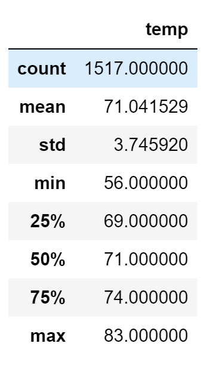
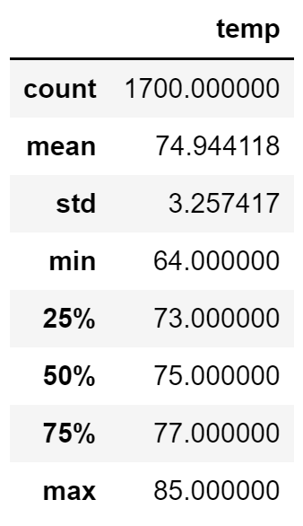

# Surfs_Up

## Overview
### Background
To convince investors of the viability of an ice cream/surf shop on the island of Oahu I was tasked with compiling weather data for the island.

### Purpose
The purpose of this analysis was to organize weather data for the island of Oahu using SQLite, and then compare summary statistics between June and December. 

## Results
- The average temperature is very similar in both December and June, with a difference of only 3-4 degrees.
- Temperatures in December have a lower minimum than in June, by 8 degrees.
- Temperatures are slightly more skewed in December than in June, with a standard deviation of 3.75 compared to 3.26 in June

### December Summary Statistics

### June Summary Statistics

## Summary
Based on the results, it can be determined that the weather in Oahu is ideal for surfing as well as ice cream. The warm weather throughout the year would allow the shop to remain open year-round, where other locations with colder winters may require the shop to close during the winter. The slightly less consistent temperatures, and lower minimum temps in December, may result in lower sales during the winter. 

An additional query that would be helpful to determine the viability of the business, would be a query to compare precipitation between the two months. Even with good temperatures, rainy days will scare off customers, so it would be good to know what the average precipitation is for the island year-round. Additionally, a query to find the weather in the fall and spring would be helpful and allow us to create visuals showing year-round weather patterns for the island. 
